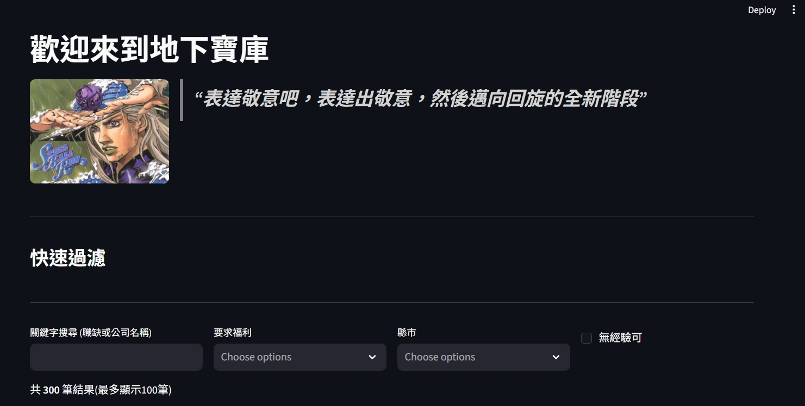
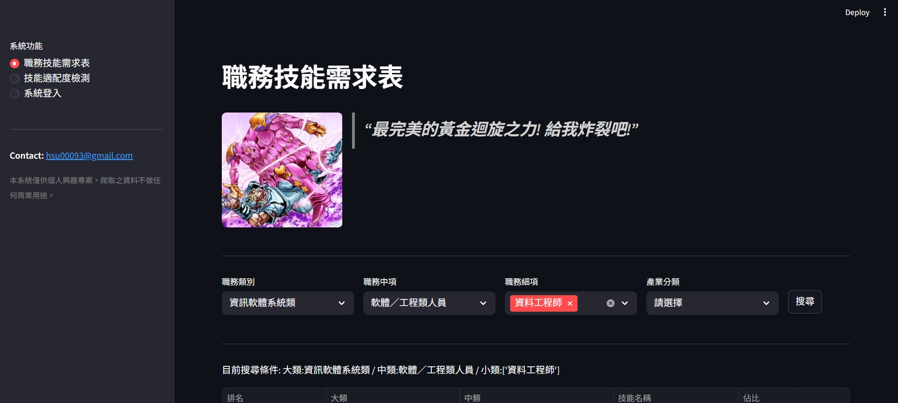
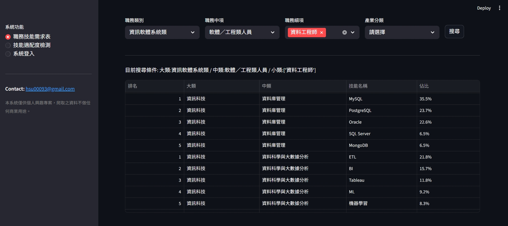
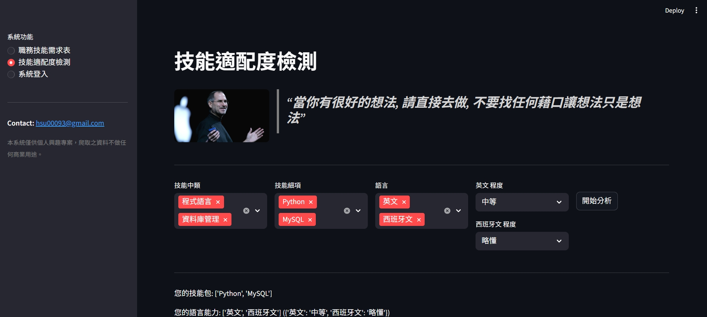
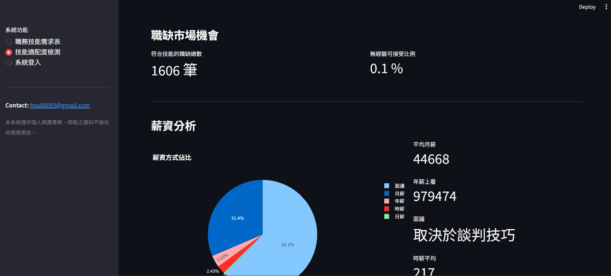
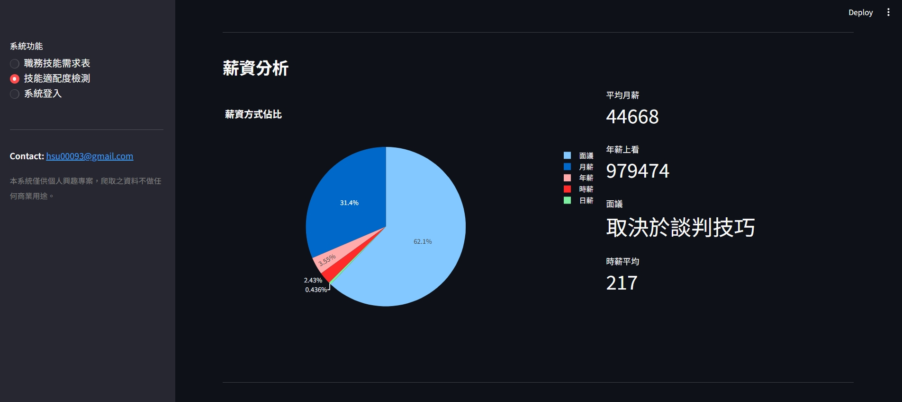
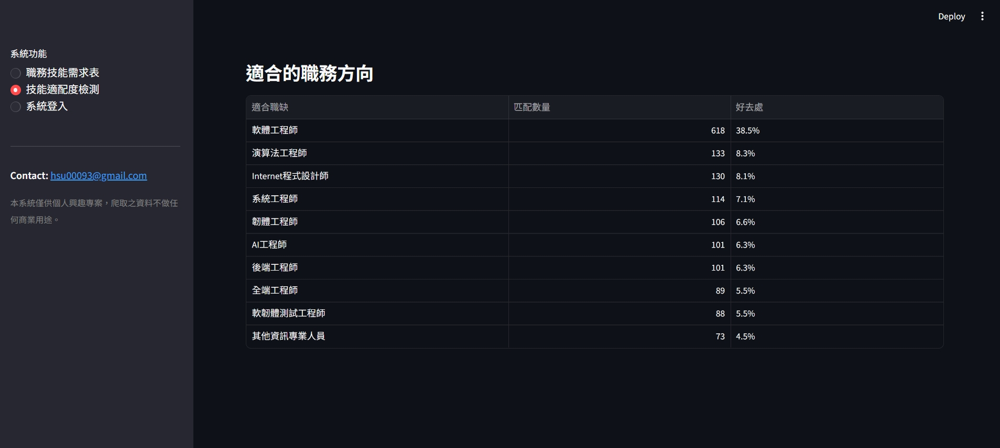

# 人力資源分析
本專案的產生是基於以下幾點
1. 為了解決轉職者的痛點,希望可以讓轉職者更明確的知曉目前市場上到底是什麼技能名列前茅並且少走彎路。
2. 因應各個產業是否有特別的技能需求。
3. 了解目前職缺在市場上有幾筆職缺以及**無經驗的**可接受比例,輸入自己的職缺可以相對的有個概念去了解自己的技能包以及語言精通程度在市面上大概到底值多少錢,並且也會展示出以目前現有的技能包最推薦去往哪些工作。

可能有人會心想,問AI不就好了嗎? 現在AI這麼發達,為何還要做這種問AI就能知道的事情,會有這種想法並不奇怪,但這證明了您用AI卻從未質疑過AI的回答是否正確,其實AI是會騙人的並且一旦涉及到沒有實質資訊的事情會是基於推測推理出來的,本專案的資料來源屬於人力銀行,資料來源皆為真材實料,故而做出來的統計數據也將會是真實可靠。

由衷希望使用者們如果使用起來不錯,可以給一些意見反饋,目前我還只是個在轉職班只學習不到三個月的學生,一定還有很多地方是不足的,感謝各位觀看到這,接下來就是技術使用及使用圖表。

# 技術使用
Python: 本專案的程式語言。
Docker: 架設虛擬環境上的使用,可輕鬆丟棄。  
**Scrapy**: 不用 bf4&request 是因為要爬蟲的數量過於多,使用Scrapy會是一個更好的效率選擇。
**MinIO**: 存取爬蟲下來的原始非結構化資料,選擇MinIO最重要的原因是免費不用錢。 
**MySQL**: 存取經過 ETL 後的資料結構,置放最乾淨的結構化資料。  
**Streamlit**: 互動式的資料視覺化呈現。
**GCP**: 基礎設施自動化。

## 系統功能
**職務技能需求表**: 立刻清楚知道市場目前最要求的多樣 Top.10 技能.
**技能適配度檢測**: 輸入目前擁有的技能包與語言能力, 推導出適合的職缺與薪資落點.
**後臺機制**: 特別引入帳號密碼及可註冊系統

**以下是展示畫面**:

